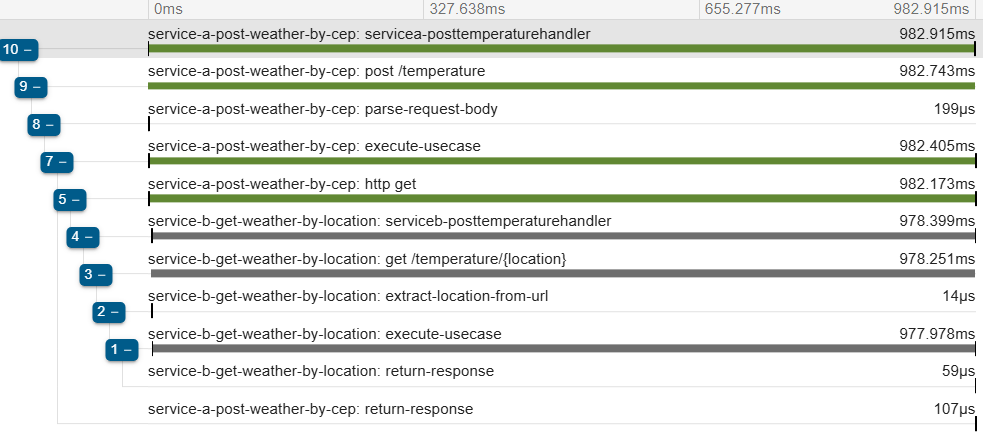
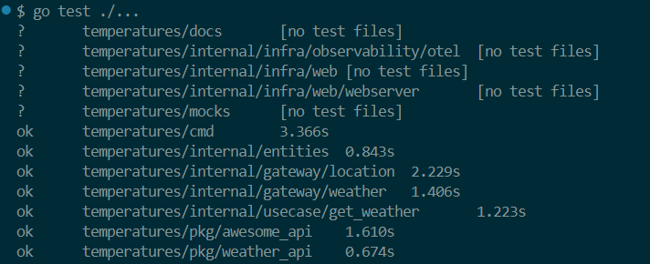
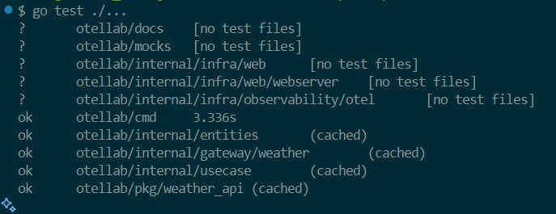

# 🌐 Sistema de Temperatura com Tracing Distribuído (Serviço A + Serviço B)

Este projeto consiste em dois serviços desenvolvidos em **Go**, que se comunicam via HTTP para receber um **CEP (Código de Endereçamento Postal - Brasil)**, identificar a **cidade correspondente** e retornar o **clima atual (Celsius, Fahrenheit e Kelvin)**. O sistema também conta com **OpenTelemetry (OTEL)** e **Zipkin** para **rastreabilidade distribuída (distributed tracing)**.

---

## 📦 Visão Geral dos Serviços

### 🔸 Serviço A - Input
Responsável por receber um **CEP via requisição POST**, validar o formato e encaminhar a requisição ao Serviço B.

### 🔸 Serviço B - Orquestração e Clima
Recebe um **CEP válido**, consulta a **cidade correspondente via API de CEP** e obtém os **dados climáticos**, formatando e retornando a resposta final.

---

## 🐳 Como Executar o Projeto

### ✅ Pré-requisitos
- **Docker** instalado na máquina.

### 📥 Clone o Repositório
```bash
git clone https://github.com/LuisGaravaso/goexpert-temperature-lab2.git
cd goexpert-temperature-lab2
```

### 🔐 Configurar Variáveis de Ambiente
O `docker-compose.yaml` insere variáveis de ambiente nos containers.
Crie um arquivo `.env` na raiz do projeto com a sua chave da **WeatherAPI** (usada pelo Serviço B):

```dotenv
WEATHER_API_KEY=your_weather_api_key_here
```

### ▶️ Subir os Contêineres
```bash
docker-compose up -d
```

### 🌐 Endpoints Disponíveis
- **Serviço A (Input):** http://localhost:8080/swagger/index.html  
- **Serviço B (Orquestração):** http://localhost:8081/swagger/index.html  
- **Zipkin (Tracing Dashboard):** http://localhost:9411

---

## 📈 Observabilidade com OTEL + Zipkin

Ambos os serviços estão instrumentados com:
- **OpenTelemetry** para geração de spans e propagação de contexto.
- **Zipkin** para visualização dos rastreamentos.
- As requisições possuem spans distribuídos que medem:
  - Validação do CEP
  - Chamada à API de localização (AwesomeAPI)
  - Chamada à API de clima (WeatherAPI)

### 🔍 Exemplo no Zipkin:


---

## ⚙️ Funcionalidades

### ✔ Serviço A
- Recebe CEP via POST
- Valida o input (string com 8 dígitos numéricos)
- Encaminha para o Serviço B via HTTP
- Retorna erro 422 para CEPs inválidos

### ✔ Serviço B
- Busca cidade via [AwesomeAPI](https://docs.awesomeapi.com.br/api-cep)
- Consulta clima via [WeatherAPI](https://www.weatherapi.com/)
- Converte temperatura para:
  - Celsius
  - Fahrenheit
  - Kelvin
- Retorna cidade e clima atual

### Ambos os serviços oferecem:
- API RESTful com respostas padronizadas
- Documentação interativa via Swagger
- Testes automatizados organizados por camadas
- Execução simplificada via Docker/Docker Compose

---

## 📡 Exemplos de Requisição

### ✅ Sucesso
```bash
curl -X 'POST' \
  'http://localhost:8080/temperature' \
  -H 'accept: application/json' \
  -H 'Content-Type: application/json' \
  -d '{ "cep": "01001001" }'
```

**Resposta:**
```json
{
  "cep": "01001001",
  "coordinates": "-23.5502784,-46.6342179",
  "city": "Sao Paulo",
  "region": "Sao Paulo",
  "country": "Brazil",
  "temp_C": 26.1,
  "temp_F": 78.98,
  "temp_K": 299.25
}
```

### ❌ Input Inválido
```json
HTTP 422 Unprocessable Entity
{ "error": "invalid zipcode" }
```

### ❌ JSON Malformado
```json
HTTP 400 Bad Request
{ "error": "invalid JSON body, must be in the format {cep: 01001001}" }
```

### ❌ CEP Não Encontrado
```json
HTTP 404 Not Found
{ "error": "location not found" }
```

### ❌ Erro interno
```json
HTTP 500 Not Found
{ "error": "internal server error" }
```

---

## 📁 Estrutura do Projeto

```
root/
├── service-a/               # Serviço A (Input de CEP)
├── service-b/               # Serviço B (Clima por Localidade)
├── docker-compose.yml       # Infraestrutura completa com OTEL e Zipkin
└── README.md
```

---

## 🧪 Testes Automatizados

O projeto possui testes organizados por camadas, garantindo robustez e qualidade.

### ✅ Tipos de Testes

- **Testes de Unidade**
  - Ex: `location_test.go`, `weather_api_test.go`

- **Testes de Integração**
  - Verificam integração com interfaces e gateways externos (mocks utilizados)

- **Testes End-to-End (E2E)**
  - Simulam requisições reais do usuário à API

### ▶️ Execução dos Testes

#### 1. Configurar variável de ambiente

Necessário ter o `.env` com `WEATHER_API_KEY` em `./pkg/weather_api/.env`

```dotenv
WEATHER_API_KEY=sua_key_aqui
```

#### 2. Testar o Serviço B (Standalone)
Abra um terminal onde você clonou o repositório e faça
```bash
cd service_b
go test ./...
```

Você verá:



#### 3. Subir o Serviço B (modo manual)

Abra um terminal onde você clonou o repositório e execute:
```bash
cd service_b/cmd
go run main.go
```
Você verá:
```
2025/03/17 15:51:26 Starting web server on port :8081
```

#### 4. Testar o Serviço A

Abra um novo terminal onde você clonou o repositório e execute:
```bash
cd service_a
go test ./...
```



---

## 🔧 Tecnologias Utilizadas

- **Golang**
- **OpenTelemetry**
- **Zipkin**
- **Docker / Docker Compose**
- **AwesomeAPI (CEP)**
- **WeatherAPI (Clima)**